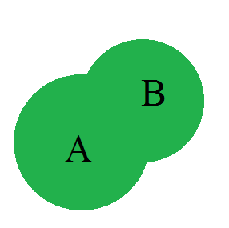
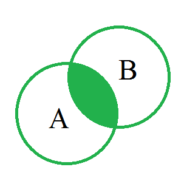
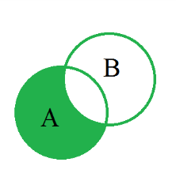
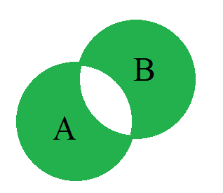

# 📑 Laboratory Work #1: Sets & Basic Operations

> **Course:** Computer & Discrete Mathematics (CDM)  
> **Institution:** Vinnytsia National Technical University (VNTU)  

---

## 🎯 Goal

Master fundamental concepts of set theory, methods of specifying sets, creation of power sets ($\mathcal{P}(A)$ or $2^A$), and computation of basic set operations (union, intersection, difference, symmetric difference) with Euler-Venn diagram visualizations.

---

## 📐 Theoretical Background

A **set** is a fundamental mathematical concept representing a collection of distinct objects, called elements. If an object $x$ belongs to a set $A$, it is written as $x \in A$; otherwise, $x \notin A$.

### Methods of Representing Sets

1. **Verbal (Descriptive):** Describing characteristic properties of elements (e.g., "the set of all even integers").
2. **Roster (Explicit List):** Enumerating all elements within curly braces: $A = \{0, 1, 2, 3, 4, 5, 6, 7, 8, 9\}$.
3. **Set-Builder (Predicate Notation):** Defining a set via a logical predicate $P(x)$ that evaluates to true for elements of the set: $A = \{ x \mid P(x) \}$. For example, $A = \{ x \in \mathbb{N} \mid x \text{ is even} \}$.
4. **Inductive (Generative Procedure):** Specifying base element(s) and rules/algorithms to generate new elements (e.g., $a_1 = 1, a_{n+1} = a_n + 2$).
5. **Analytical:** Defining sets using algebraic expressions involving set operations and universal set subsets.

### Power Set (Boolean Set)

The **power set** $\mathcal{P}(A)$ (or $2^A$) of a set $A$ is the set of all possible subsets of $A$, including the empty set $\emptyset$ and $A$ itself:
$$\mathcal{P}(A) = \{ S \mid S \subseteq A \}$$
If $|A| = n$, the total number of subsets in the power set is $|\mathcal{P}(A)| = 2^n$.

### Fundamental Set Operations

Let $A$ and $B$ be subsets of a universal set $U$:

- **Union ($A \cup B$):** The set of all elements belonging to $A$, $B$, or both:
  $$A \cup B = \{ x \mid x \in A \lor x \in B \}$$
- **Intersection ($A \cap B$):** The set of elements that belong to both $A$ and $B$:
  $$A \cap B = \{ x \mid x \in A \land x \in B \}$$
- **Difference ($A \setminus B$):** The set of elements belonging to $A$ but not to $B$:
  $$A \setminus B = \{ x \mid x \in A \land x \notin B \}$$
- **Symmetric Difference ($A \Delta B$):** The set of elements belonging to either $A$ or $B$, but not both:
  $$A \Delta B = (A \setminus B) \cup (B \setminus A) = \{ x \mid (x \in A \land x \notin B) \lor (x \in B \land x \notin A) \}$$
- **Complement ($\overline{A}$):** The set of all elements in the universe $U$ not in $A$:
  $$\overline{A} = U \setminus A = \{ x \in U \mid x \notin A \}$$

### 🖼️ Euler-Venn Diagrams

| Set Operation | Visual Illustration |
| :--- | :---: |
| **Intersection ($A \cap B$)** |  |
| **Union ($A \cup B$)** |  |
| **Difference ($A \setminus B$)** |  |
| **Symmetric Difference ($A \Delta B$)** |  |

---

## 💻 Implementation & Code Structure

The application [`main.py`](./main.py) features a graphical user interface (GUI) built with **Tkinter** and **Matplotlib / matplotlib-venn**.

### Key Functions in `main.py`

- `get_all_subsets(source_set)`: Generates all $2^{|A|}$ subsets using `itertools.combinations`.
- `process_data()`: Parses user input strings into sets, evaluates set operations, and updates the Matplotlib Venn diagram plots in real-time.

---

## 🚀 How to Run

1. Install prerequisites:

   ```bash
   pip install matplotlib matplotlib-venn
   ```

2. Run the application:

   ```bash
   python main.py
   ```

---

## 📄 Guidelines & Documents

- [Lab Guidelines (PDF)](./ЛР1_Множини_Основні_поняття.pdf)
